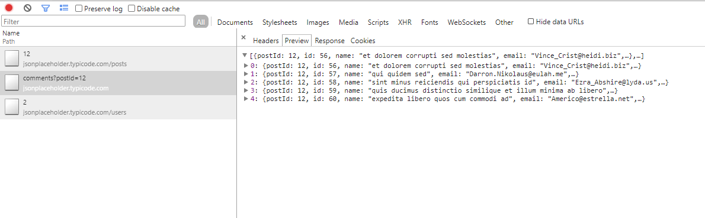
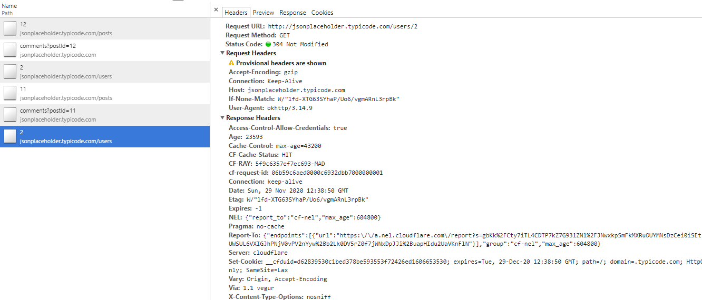
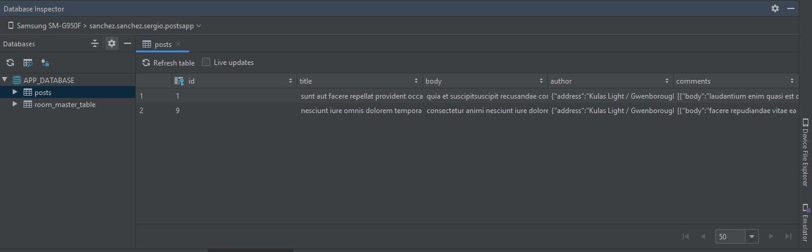
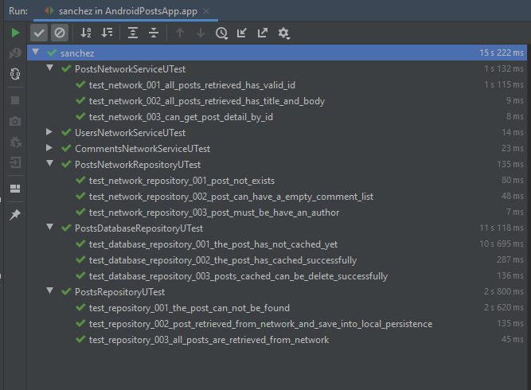

# Android {JSON} Placeholder Prototyping App

## Main Goals

* Clean architecure approach.
* Dependency injection through Dagger.
* Asynchronous operations management with coroutines.
* Using Material Design guidelines.
* Using local storage baseond on Jetpack Room Library to implement cache layer through repository pattern.
* Testing with mockito-kotlin, assertj, junit, robolectric mock web server..

## Points to be assess.

* Post detail is retrieved only once, next calls get the information from local storage.

* Also, I have configured a HTTP cache layer to give support to the ETAG mechanism. If a second post has the same author that has been retrieved before, is not necessary to get the same data again.

* You can see with the Android Studio database inspector how the data is structured to persist locally.

* Unit tests have been implemented to validate the logic implemented in the repository layer

## Screenshots

